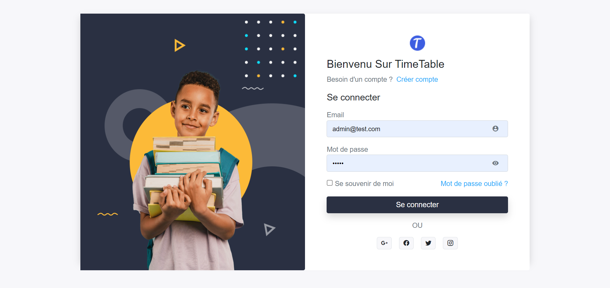
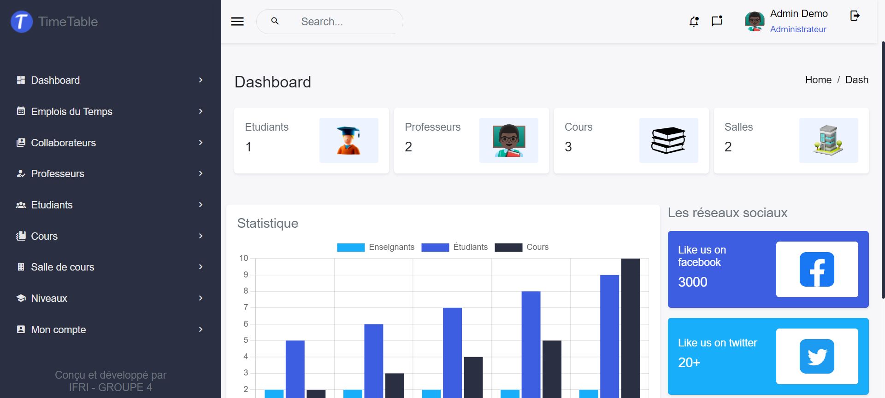
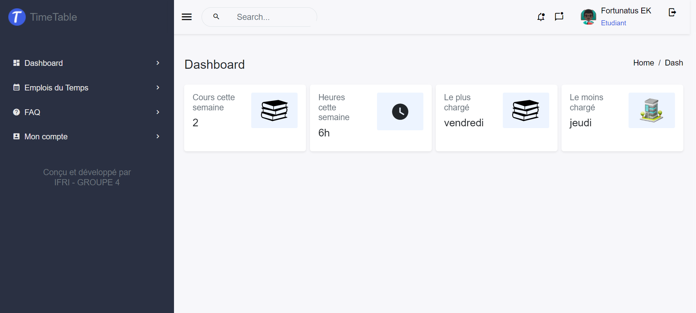
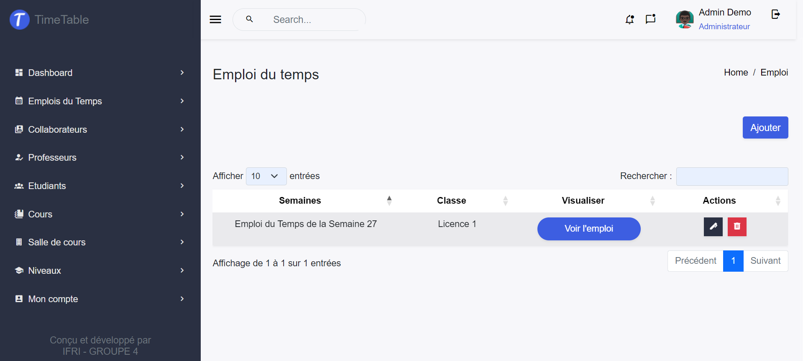
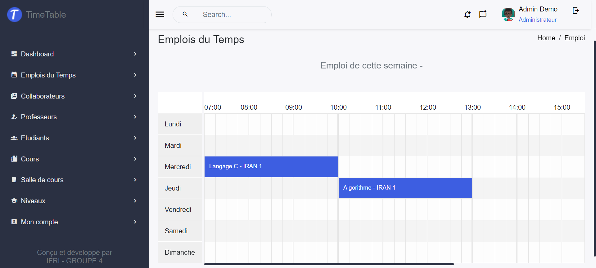

## Preview

### - Authentification


### Dashboard (Admin)



### Dahboard (Etudiant)



### Dashboard (Professeur)


### Liste des emplois du temps (Admin)



### Visualisation d'un emplois du temps



## DEMO

Vous pouvez tester le démo de l'application sur la version en ligne avec ce compte administrateur : 

    - Email : admin@test.com
    - password : admin
## Comment installer Django

    Ouvrez votre terminal et exécutez la commande suivante pour installer Django à l'aide de l'outil de gestion de packages pip :
    ```bash
    pip install Django
    ```
    Si vous utilisez une version spécifique de Python, utilisez plutôt la commande suivante pour installer Django :

    ```bash
    python -m pip install Django
    ```	
Attendez que l'installation se termine. Une fois terminée, vous devriez avoir Django installé sur votre machine.

Pour vérifier si Django est installé correctement, exécutez la commande suivante dans votre terminal :

```bash
django-admin --version
```
Cela affichera la version de Django installée.

Maintenant que vous avez Django installé, vous pouvez continuer à travailler sur le projet d'intégration IFRI 2022.

## Comment lancer l'application sur votre machine

Pour récuperer et lancer l'application sur votre machine, assurez vous d'abord d'avoir python et django installé sur votre machine. Ensuite procéder aux étapes suivantes :

    ```bash
    git clone git@github.com:AKOWAKOU/emploi.git

    cd emploi
    python -m venv venv 
    source venv/bin/active
    pip install -r requirements.txt

    python manage.py migrate

    python manage.py runserver 8000
    ```
L'application va démarrer sur l'addresse http://localhost:8000 : copier cet addresse et lancer-le dans le navigateur.

L'application est maintenant lancé !


